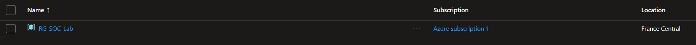
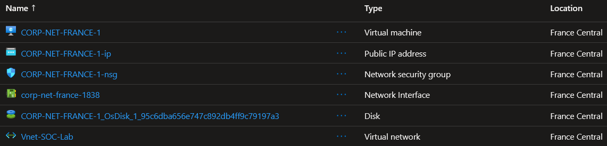
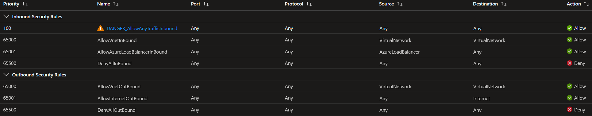

# Azure Sentinel Honeypot – Live Attack Monitoring & World Map Visualization

This project builds a **Windows honeypot in Microsoft Azure** and intentionally exposes it to the public Internet to observe how quickly real attackers start interacting with an unprotected system.  
The goal is to **collect, centralize, and analyze security logs** in a SIEM (Microsoft Sentinel), then **enrich and visualize attacks on a global map**.

The main objectives are:
- Deploy a Windows VM in Azure and make it discoverable from the Internet (honeypot approach)
- Centralize Windows security logs into a **Log Analytics Workspace (LAW)**
- Connect LAW to **Microsoft Sentinel** (SIEM)
- Query failed logon attempts (**Event ID 4625**) using **KQL**
- Enrich attacker IPs with **GeoIP** data via a Sentinel **Watchlist**
- Build an interactive **Sentinel Workbook** to map attack origins worldwide

---

## Tools used

- Microsoft Azure (Resource Group, VNet, VM)
- Windows Server / Windows VM (honeypot target)
- Network Security Group (NSG) *(intentionally disabled for the lab)*
- Windows Defender Firewall *(intentionally disabled on the VM for the lab)*
- Log Analytics Workspace (LAW)
- Azure Monitor Agent (AMA)
- Microsoft Sentinel
- Kusto Query Language (KQL)
- Sentinel Watchlists (GeoIP dataset)
- Sentinel Workbooks (attack map dashboard)

---

## Requirements

- An Azure subscription (Free tier is enough to reproduce the core lab)
- Permissions to create and manage:
  - Resource Groups, VNets, VMs
  - Log Analytics Workspace
  - Microsoft Sentinel
- A local RDP client to access the VM (for configuration and verification)
- A GeoIP file for Watchlist import (CSV/Excel format)

---

## Lab topology

- **Public Internet** → real scanners / brute-force traffic
- **Azure VNet** hosting a **Windows VM (honeypot)** with a public IP
- **Intentional exposure (lab purpose):**
  - **NSG disabled**
  - **Windows Firewall disabled**
- **Log pipeline:**
  - VM → **Azure Monitor Agent (AMA)** → **Log Analytics Workspace (LAW)** → **Microsoft Sentinel (SIEM)**
- **Analysis layer:**
  - KQL focuses on **failed logons (Event ID 4625)**
  - GeoIP **Watchlist** enriches attacker IPs
  - Sentinel **Workbook** displays a **world attack map**

> 

---

## Project steps

### Step 1 — Deploy the honeypot VM (Azure baseline)

- Create a dedicated **Resource Group** (lab container) in the target region (e.g., **France Central**).
  > 

- Deploy the **Windows VM** (honeypot) with a **Public IP** inside a **VNet**.
  > 

- Expose the VM on purpose by configuring the **NSG inbound rules** to allow Internet traffic (lab design).
  > 

---

### 2. Configuring Log Analytics Workspace

""

---

### 3. Forwarding logs and integrating with Sentinel

""

---

### 4. Querying failed login attempts and visualizing attack sources

""

---

### 5. Building an attack map to track real-time hacker activity

""

---

